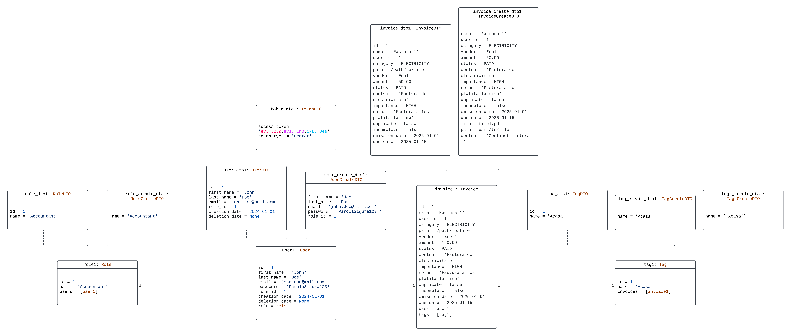

# Invoicely

## Requirements

### Functional requirements
- Track and modify the status of invoices: unpaid, paid, overdue.
- Send email notifications for overdue or close to being overdue invoices.
- Batch management of invoices for bulk actions: send, download, delete.
- Importing of paper invoices (Image processing and classification).
- Classification of invoices.
- Ability to search for key terms in the content of invoices (amount, date, vendor).
- Ability to sort invoices by key terms.
- Custom tags for invoices to better categorize them.
- Amount thresholds for specific vendors and periods of time.
- Analytics and charts for a summarized overview of the invoices.

### Non-functional requirements
- <b>Performance</b>: Achieve a response time of 1 second or less for user interactions, such as logging in, uploading and categorizing an invoice for at least 100 simultaneous requests.
- <b>Reliability</b>: Maintain an availability rate of 99.5% yearly, allowing for scheduled maintenance windows.
- <b>Security</b>: Implement secure user authentication with strong password policies at least 8 characters upper and lower case characters and at least a symbol and password hashing with bcrypt algorithm.
- <b>Usability</b>: Maintain an intuitive and user-friendly interface for managing invoices without extensive training, with a maximum 4 actions/user interactions to achieve any functionality.
- <b>Compatibility</b>: Ensure smooth operation on all type of browsers.

## Design patterns

### Builder

The **Builder** is a design pattern used to construct complex objects step by step. It separates the construction process from the object's representation, allowing you to create different representations of the object using the same construction process.

- Enables method chaining when creating a new object.
- Provides good handling of entities with multiple optional fields.

We used the Builder pattern for the Invoice entity which has 17 fields to better manage the creation of an Invoice object.
In the [invoice.py file](https://github.com/SabauEduard/invoicely/blob/main/api/models/invoice.py) you can see the implementation of the Invoice and InvoiceBuilder classes.
The builder can be seen in use in [this method](https://github.com/SabauEduard/invoicely/blob/main/api/dtos/invoice_dtos.py#L91) of the InvoiceDTO class.

### Singleton

The **Singleton** is a design pattern that restricts the instantiation of a class to one object. It is useful when exactly one object is needed to coordinate actions across the system.
- Single instantiation
- Thread-safe
- Global access through static method

The engine created in the [database.py file](https://github.com/SabauEduard/invoicely/blob/main/api/database.py) is a Singleton object handled by [SQLAlchemy](https://www.sqlalchemy.org/) that is used to interact with the database. The engine is created only once and is shared across the application.
It is used to create a session and connection for each request and to commit the changes to the database.

## Diagrams

### Use Case Diagram

### Class Diagram

### Entity Relationship Diagram

### Object Diagram

### Architecture Diagram

### ML Architecture Diagram

### Workflow Diagram

### Gantt Chart

## Contributions to the project
### Clem Daria
- Created the project structure (with Sabau Eduard)
- Dependency management with Poetry (with Sabau Eduard)
- Set up the database, drivers, migrations and ORM (with Sabau Eduard)
- Implemented User and Role models (with Sabau Eduard)
- Implemented CRUD operations for User and Role models (with Sabau Eduard)
- Implemented basic authentication with JWT & bcrypt (with Sabau Eduard)
- Implemented UI elements (with Maftei Valentin)
- Implemented ML model and ML diagram (with Maftei Valentin and Liciu Stefan)
### Sabau Eduard
- Created the project structure (with Clem Daria)
- Dependency management with Poetry (with Clem Daria)
- Set up the database, drivers, migrations and ORM (with Clem Daria)
- Implemented User and Role models (with Clem Daria)
- Implemented CRUD operations for User and Role models (with Clem Daria)
- Implemented basic authentication with JWT & bcrypt (with Clem Daria and Liciu Stefan)
- Implemented 2FA authentication
- Worked on this README file
- Workflow and Architecture diagrams
### Maftei Valentin
- Created invoice statistics
- Implemented interface notifications
- Implemented View option for invoices
- Worked on environment settings for backend (versions)
- Implemented UI elements (with Clem Daria)
- ER Diagram
- Implemented ML model and ML diagram (with Clem Daria and Liciu Stefan)
### Nitoi Antonio
- Implemented Invoice and Tag models (with Liciu Stefan)
- Implemented CRUD operations for Invoice and Tag models (with Liciu Stefan)
- Implementing automatic email reminders/notifications for upcoming, due and overdue invoices (WIP)
- Wrote User Stories and made them conform to INVEST guidelines (with Liciu Stefan)
- Wrote tasks for User Stories added to the backlog (with Liciu Stefan)
- Assigned Story Points to User Stories (with Sabau Eduard)
- Class and Object diagrams
### Liciu Stefan
- Implemented Invoice and Tag models (with Nitoi Antonio)
- Implemented CRUD operations for Invoice and Tag models (with Nitoi Antonio)
- Wrote User Stories and made them conform to INVEST guidelines (with Nitoi Antonio)
- Wrote tasks for User Stories added to the backlog (with Nitoi Antonio)
- GANTT Diagram
- Implemented basic authentication with JWT & bcrypt (with Clem Daria and Sabau Eduard)
- Implemented Builder design pattern for Invoices
- Implemented ML model and ML diagram (with Maftei Valentin and Clem Daria)
